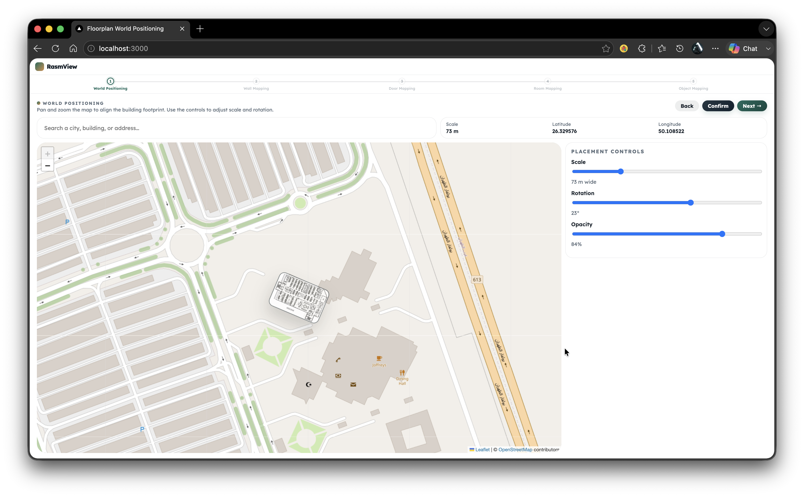
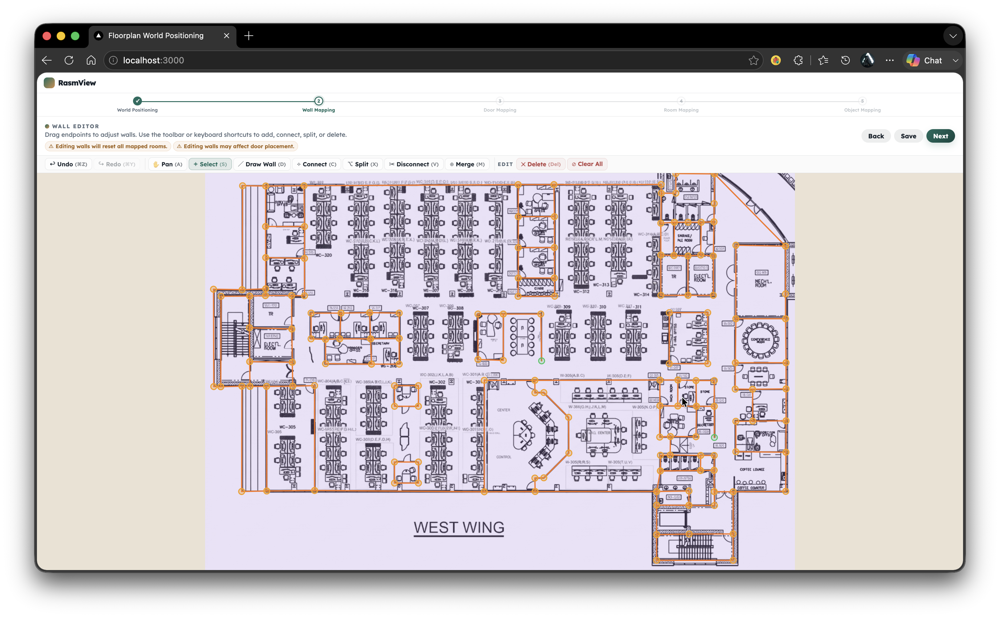
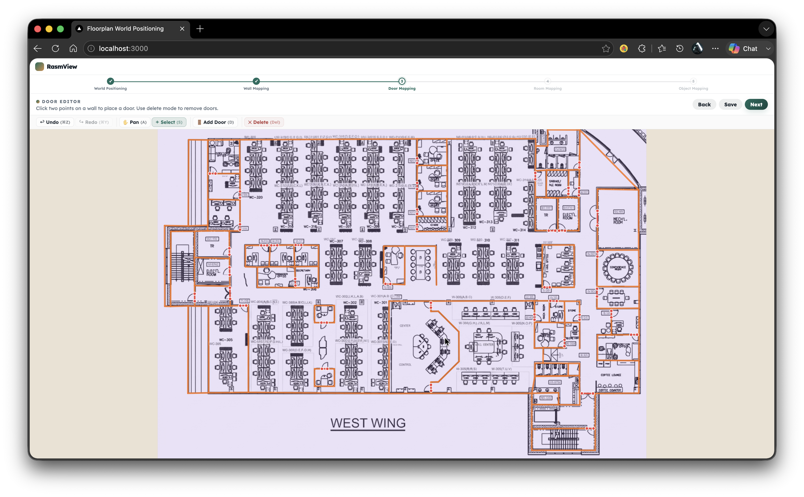
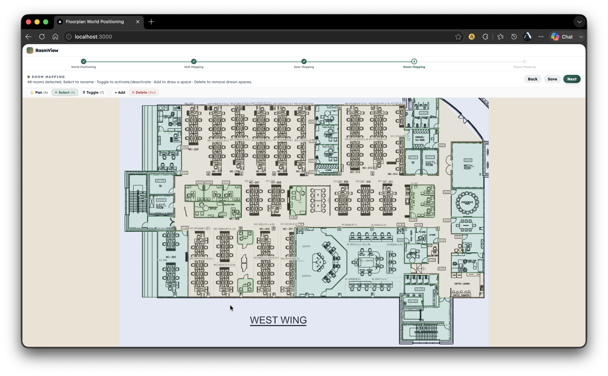
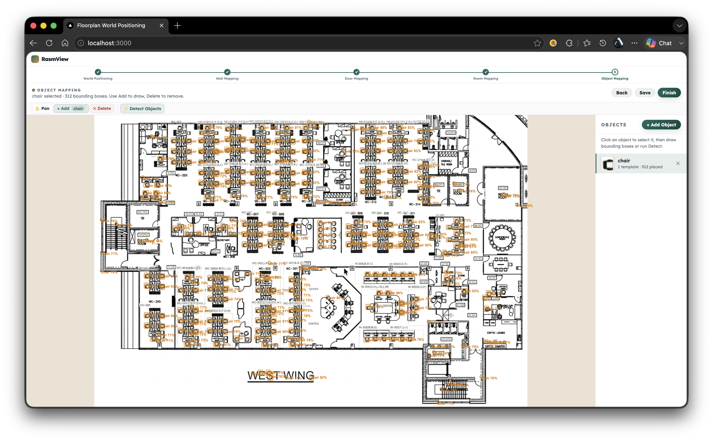

# RasmView — Floor Plan AI Processing & Editor

RasmView is a web application for processing architectural floor plan images using AI, then annotating them through a guided, step-by-step editor. Upload a floor plan image, run AI-powered detection to extract walls, rooms, and objects, position the plan on a real-world map, and export a structured JSON result ready for downstream spatial applications.

The workflow has five sequential steps:

1. **World Positioning** — Place the floor plan on an interactive map (OpenStreetMap), set its scale in meters, and adjust its rotation.



2. **Wall Mapping** — Review and correct the AI-detected wall segments. Draw, split, merge, move, and connect walls manually.



3. **Door Mapping** — Mark doors by clicking on walls to place door segments.



4. **Room Mapping** — Run automatic room detection from the enclosed wall geometry, then rename or adjust rooms.



5. **Object Mapping** — Upload template images for object classes (e.g. fire extinguishers, chairs) and run template-matching detection across the floor plan.



---

## Running with Docker (recommended)

**Prerequisites:** Docker Desktop installed and running.

```bash
# From the repo root
docker compose up --build
```

The app is available at **http://localhost:3000**.

The first build downloads Python dependencies and packages the YOLO model weights — this takes a few minutes. Subsequent `docker compose up` calls (without `--build`) start in seconds.

To stop:

```bash
docker compose down
```

Uploaded files and detection results are stored in a named Docker volume (`uploads`) and survive container restarts. To also wipe data:

```bash
docker compose down -v
```

### Environment variables

Copy `.env.example` (or set directly in the shell) before running if you need to override defaults:

| Variable | Default | Description |
|---|---|---|
| `UPLOAD_SECRET` | hardcoded fallback | HMAC secret for signed upload URLs. Set a real random value in production. |
| `OUTPUT_DIR` | `/app/editor-be/uploads` | Where detection results are written (inside the container). |
| `YOLO_WEIGHTS` | `…/cubicasa_yolo26m/weights/best.pt` | Path to the YOLO model weights file (inside the container). |
| `PORT` | `5001` | Flask server port. |

---

## Running without Docker

### Backend (Flask, Python 3.11+)

```bash
cd editor-be

pip install flask flask-cors ultralytics opencv-python-headless shapely numpy requests werkzeug

# Set required environment variables
export OUTPUT_DIR="$(pwd)/uploads"
export YOLO_WEIGHTS="../floor_ingestion/detector/yolo/runs/cubicasa_yolo26m/weights/best.pt"
export UPLOAD_SECRET="any-random-string"

python app.py
# Runs on http://localhost:5001
```

### Frontend (Node 18+)

```bash
cd editor-fe

npm install
npm run dev
# Runs on http://localhost:3000
# Vite proxies /api and /uploads to http://localhost:5001 automatically
```

Open **http://localhost:3000** in your browser. Both services must be running simultaneously.

### floor_ingestion (Python package)

The `floor_ingestion/` directory is a Python package consumed directly by the backend — no separate process needed. It must be on the Python path, which the backend arranges automatically via `sys.path` manipulation in `api/process.py`.
